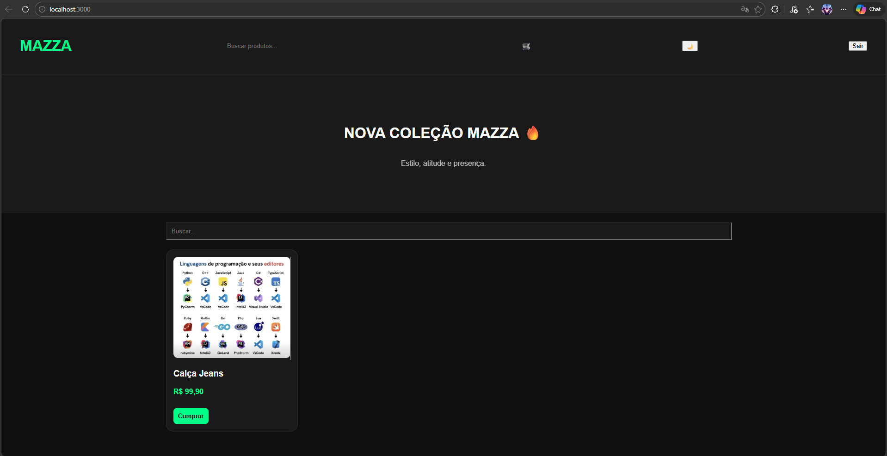
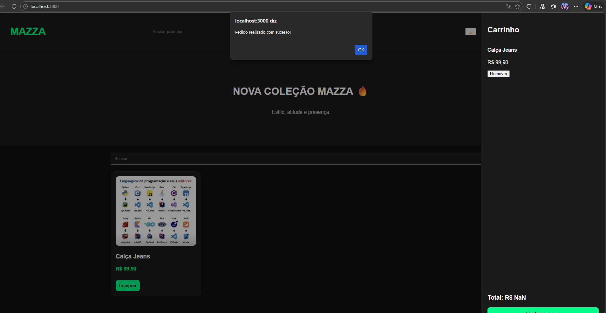
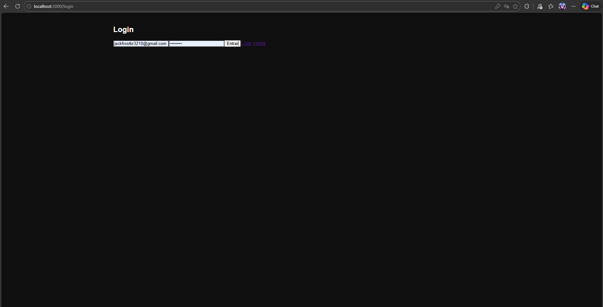
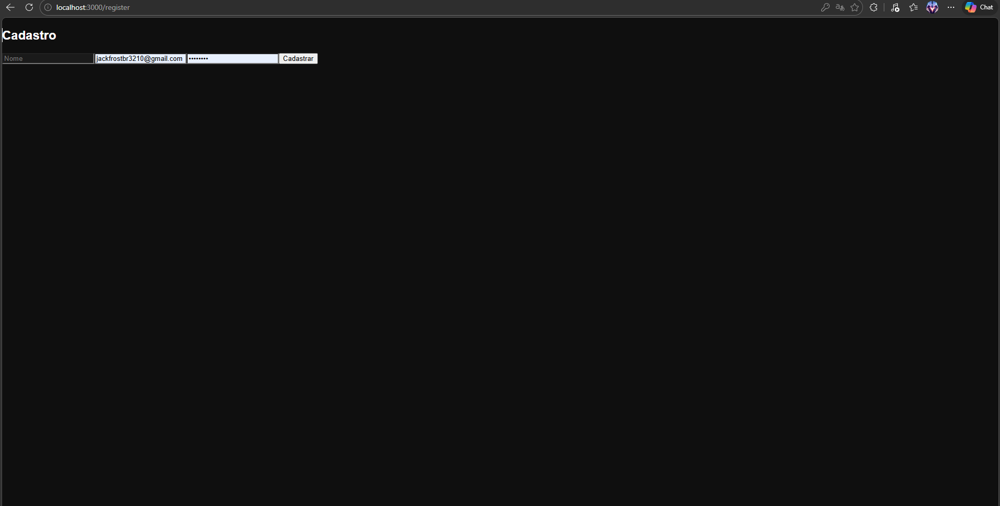

# Mazza Moda Masculina

Aplicação de e-commerce desenvolvida com foco em simular uma loja virtual real, utilizando tecnologias modernas de desenvolvimento web.

## Status do Projeto
Em desenvolvimento

## Tecnologias Utilizadas

### Frontend
- React
- JavaScript (ES6+)
- HTML5
- CSS3

### Backend
- Node.js
- Express
- Firebase

## Funcionalidades

- Listagem de produtos
- Interface responsiva
- Integração com banco de dados
- API backend estruturada
- Carrinho de compras (em desenvolvimento)

## Estrutura do Projeto

/backend → API e regras de negócio
/mazza-moda-masculina → Frontend da aplicação

## Preview

## Aprendizados

Este projeto está sendo desenvolvido com foco em aprimorar habilidades em desenvolvimento fullstack, organização de código, integração entre frontend e backend e boas práticas de mercado.

## Autor

Bruno Cardoso  
[LinkedIn](https://www.linkedin.com/in/bruno-cardoso-1bb095204)
